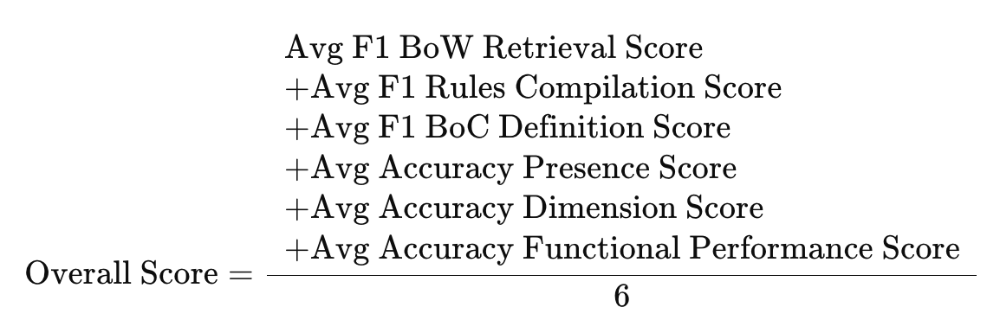

# DesignQA Benchmark

**DesignQA: A Multimodal Benchmark for Evaluating Large Language Models' Understanding of Engineering Documentation**

Read the paper [here](https://decode.mit.edu/assets/papers/PRODUCTION_JCISE_DesignQA.pdf)!

Check out our official website and leaderboard [here](https://design-qa.github.io/)!


## IDETC Hackathon 2025

**DesignQA is an IDETC Hackathon problem!!**  
More hackathon details can be found:

**[Problem Statement](https://docs.google.com/document/d/1LHNeR43yV3V4RchvwbLkLtKHeTPJNfeN7SBOGBDwgTY/edit?usp=sharing)** - Please read this problem statement in detail before beginning!

**[Presentation Slides](https://docs.google.com/presentation/d/1tDNuBypVI6RAIeluFsKlpYgqknvDarjxTHNV90Tzpuw/edit?usp=sharing)**

### Setup

First, git clone this repo and cd into `design_qa`:

```
git clone https://github.com/anniedoris/design_qa.git && cd design_qa
```

Next, create a conda environment and install the requirements:

```
conda create -n design_qa python=3.10 -y && conda activate design_qa && pip install -r requirements.txt
```

### Running the Evaluation
To evaluate your approach's score on the DesignQA benchmark, run:

```
python eval/full_evaluation.py --path_to_retrieval {path_to_csv_for_retrieval} --path_to_compilation {path_to_csv_for_compilation} --path_to_definition {path_to_csv_for_definition} --path_to_presence {path_to_csv_for_presence} --path_to_dimension {path_to_csv_for_dimension} --path_to_functional_performance {path_to_csv_for_functional_performance}
```

Each csv file should have two columns: `ground_truth` and `model_prediction`. The `ground_truth` column should contain the correct answers to the questions, while the `model_prediction` column should contain your model/approach's corresponding answer. Essentially, when you evalaute your solution, you should copy each of the dataset csvs (detailed in the [Dataset](#dataset) section below) and add a column called `model_prediction` for your solutions's answers.

If you want to see how this works for a model (LLaVA) that we evalauted in our paper, you can run:

```
python eval/full_evaluation.py --path_to_retrieval eval/rule_extraction/retrieval_evaluation_llava-13b.csv --path_to_compilation eval/rule_extraction/compilation_evaluation_llava-13b.csv --path_to_definition eval/rule_comprehension/definition_evaluation_llava-13b.csv --path_to_presence eval/rule_comprehension/presence_evaluation_llava-13b.csv --path_to_dimension eval/rule_compliance/dimension_context_evaluation_llava-13b.csv --path_to_functional_performance eval/rule_compliance/dimension_functional_performance_evaluation_llava-13b.csv
```

This will output a file called `results.txt` that contains your overall score on the benchmark. Note that your overall score is an average of your approach's scores across all six segments of the benchmark, like so:




`Results.txt` will also contain other interesting diagnostic metrics, along with the scores for each individual question in the benchmark. Keep in mind that the number of questions in each segment of the benchmark is different (see below overview image), but overall score is a simple average (not weighted), so you may want to consider this when designing your approach!


## Overview

DesignQA is a novel benchmark aimed at evaluating the proficiency of multimodal large language models (MLLMs) in comprehending and applying engineering requirements in technical documentation. The benchmark is developed in conjunction with the MIT Motorsport team, so that the question-answer pairs are based on real world data and the ~200 page FSAE competition rules. Some key features of the DesignQA benchmark include:

* 1451 question-answer pairs pertaining to design of an FSAE vehicle according to the FSAE competition rules

* 3 benchmark segments - rule extraction, rule comprehension, and rule compliance - that enable fine-grained investigation into a model's strengths and weaknesses when it comes to design according to 

* Automatic evaluation metrics for quick scoring of new MLLMs

* A unique benchmark that requires models to analyze and integrate information from both visual and long-text inputs

Here is a visual overview of the benchmark:


## Dataset
The dataset can be found in the ```dataset``` directory. The dataset is split into three sections: Rule Extraction, Rule Comprehension, and Rule Evaluation. Each dataset section has two different subsets, each of which corresponds with a specific task needed to design according to technical documentation. Examples of the segments and subsets are as follows:

### Rule Extraction
This segment of the dataset tests a model's ability to extract requested information from a lengthy technical document. The questions in this segment do not involve images. The Rule Extraction question-answer pairs are further divided into two subsets: Retrieval QAs and Compilation QAs.

#### Retrieval QAs
These questions ask the model to extract a specific rule from the 2024 FSAE competition rules. The retrieval QAs can be found in ```dataset/rule_extraction/rule_retrieval_qa.csv```. All of the questions have the format:

```
We are a student engineering team designing a vehicle for the FSAE competition. Attached is the FSAE rules document. What does rule {rule_number} state exactly? Answer with only the text of the rule and no other words.
```

An example ground-truth answer (for rule V.1) is:

```
CONFIGURATION The vehicle must be open wheeled and open cockpit (a formula style body) with four wheels that are not in a straight line.
```

#### Compilation QAs
These questions ask the model to find all rules in the FSAE competition rules relevant to a specific term. The compilation QAs can be found in ```dataset/rule_extraction/rule_compilation_qa.csv```. All of the questions have the format:

```
We are a student engineering team designing a vehicle for the FSAE competition. Attached is the FSAE rules document. Please list all rules relevant to {term}. Answer with only the rule numbers (i.e.: AA.1.1.1) separated by commas and no other words. The rules relevant to `Aerodynamic/Aerodynamics` are:
```

An example ground-truth answer (for rule the term `Aerodynamic/Aerodynamics`) is:

```
['T.7', 'T.7.1', 'T.7.1.1', 'T.7.1.3', 'T.7.2.1', 'T.7.2.2', 'T.7.3.1', 'T.7.3.3', 'T.7.4', 'T.7.5', 'T.7.6', 'T.7.6.3', 'T.7.7.1', 'IN.8.2', 'IN.8.2.1', 'IN.8.2.3', 'T.7.1.2', 'T.7.1.4', 'T.7.1.5', 'T.7.2', 'T.7.2.3', 'T.7.2.4', 'T.7.3', 'T.7.3.2', 'T.7.6.1', 'T.7.6.2', 'T.7.7', 'T.7.7.2', 'IN.8.2.2', 'GR.6.4.1', 'V.1.1', 'V.1.4.1']
```

### Rule Comprehension
This semgnet of the dataset tests a model's ability to understand the terms and definitions presented within many of the rules and requiriements. The questions in this segment involve images. The Rule Comprehension question-answer pairs are further divded into two subsets: Definition QAs and Presence QAs.

#### Definition QAs
These questions ask the model to identify the name of a component highlighted in pink in a multi-view CAD image. The definition QA images can be found in ```dataset/rule_comprehension/rule_definition_qa/``` and the question-answers can be found in ```dataset/rule_comprehension/rule_definition_qa.csv```. An example question is as follows:

```
We are a student engineering team designing a vehicle for the FSAE competition. Attached is the FSAE rules document. Also attached is an image showing six CAD views of our vehicle design. What is the name of the component(s) highlighted in pink? Answer just with the name of the highlighted component(s) and nothing else.
```


The corresponding ground-truth answer is as follows, where synonyms are separated by semi-colons:

```
pedal box; pedal assembly
```

#### Presence QAs
These questions ask the model to identify whether a specific component is present in a zoomed-in CAD view. As such, the responses are yes/no answers and this is an easier variant of the Definition QAs. The presence QA images can be found in ```dataset/rule_comprehension/rule_presence_qa/``` and the question-answers can be found in ```dataset/rule_comprehension/rule_presence_qa.csv```. An example question is as follows:

```
We are a student engineering team designing a vehicle for the FSAE competition. Attached is the FSAE rules document. Also attached is an image showing seven CAD views (each boxed in black) of our vehicle design. The top, big view shows a close-up view of the design. The six smaller views on the bottom of the image show different complete views of the CAD of the vehicle and are provided for context. Note that the close-up view orientation matches one of the six complete view orientations. The close-up view may also have some components hidden (with respect to the corresponding complete view) for visualization of specific components. Looking at the close-up view, is/are any part of the the accumulator or the accumulator container or the battery visible in the close-up view? Answer simply with yes or no.
```


The corresponding ground-truth answer is as follows:

```
no
```

### Rule Compliance
The final segment of the benchmark tests a model's ability to determine whether a design conforms with a specific rule. Te questions in this segment involve images. The Rule Compliance question-answer pairs are further divided into two subsets: Dimension QAs and Functional Performance QAs. 

#### Dimension QAs
These questions ask the model to determine whether a design complies with a dimensional constraint specified in a rule from the FSAE competition document. The dimension QAs and images can be found in ```dataset/rule_compliance/rule_dimension_qa/```. This directory is further divided into ```context/``` and ```detailed_context/``` subdirectories: the detailed_context questions contain additional context in the prompts and images (such as highlights of specific components) that we hypothesized would make answering the questions easier. The regular context questions do not have this additional helpful context. When scoring the dimension questions, we run both the ```context/``` and ```detailed_context/``` questions and average the scores together. An example question (without detailed context) is as follows:


The corresponding ground-truth answer is as follows:

```
yes
The image shows the radius of wheels which (multiplied by 2) is greater than rules minimum wheel diameter.

```

#### Functional Performance QAs
These questions ask the model to determine whether a design complies with a functional performance-related rule from the FSAE competition document. The functional performance QAs can be found in ```dataset/rule_compliance/rule_functional_performance_qa.csv``` and the corresponding images can be found in ```dataset/rule_compliance/images```. An example question is as follows:

```
We are a student engineering team designing a vehicle for the FSAE competition. Attached is the FSAE rules document. Also attached is an image that shows the results from an FEA simulation performed on the battery structure. The battery structure is made from non-welded 6061-T6 aluminum tubing. Based on the results presented in the image and rule F.3.5.3b in the rule document, can we use the battery structure in the vehicle? First provide an explanation for your answer (begin it with ‘Explanation:’). Then provide just a yes/no answer (begin it with ‘Answer:’) that summarizes your response.
```


The corresponding grouth-truth answer is as follows:

```
yes
We should use the battery structure in the vehicle because the stress result in the FEA model is less than the yield strength of non-welded 6061-T6 tubing (240 Mpa).
```


## Automatic Evaluation Metrics
Each subset of the benchmark can be scored using an automated evluation metric. The details of the evaluation metrics and the decision behind using each one can be found in our paper. The metrics are implemented in ```eval/metrics/metrics.py```.

## Leaderboard
We have a [leaderboard](https://design-qa.github.io/)! To submit to the leaderboard, please file a github issue and make sure to include your ```.txt``` file results as well as the code that you used for the model evaluation. We will manually verify the results and post to our leaderboard!


## Citations
If you use our benchmark in your work, please make sure to cite us!

```
@article{doris2025designqa,
  title={DesignQA: A multimodal benchmark for evaluating large language models’ understanding of engineering documentation},
  author={Doris, Anna C and Grandi, Daniele and Tomich, Ryan and Alam, Md Ferdous and Ataei, Mohammadmehdi and Cheong, Hyunmin and Ahmed, Faez},
  journal={Journal of Computing and Information Science in Engineering},
  volume={25},
  number={2},
  pages={021009},
  year={2025},
  publisher={American Society of Mechanical Engineers}
}
```

## Quick pipeline run (Hackathon strategy)

1. Create environment and install requirements (see above). Additionally install optional retriever deps:

```
pip install rank-bm25
```

2. Run the end-to-end pipeline and evaluation:

```
PYTHONPATH=. python3 scripts/run_pipeline_and_eval.py
```

Alternatively:

```
python3 -m scripts.run_pipeline_and_eval
```

This generates CSVs in `your_outputs/` for all subsets, concatenates dimension subsets, and runs `eval/full_evaluation.py` to produce `results.txt`.

- Retrieval and compilation use a hybrid BM25 + dense retriever with regex expansions.
- Visual subsets use pluggable model clients with strict format normalization and short outputs (<=120 chars where applicable).
- A format fixer `fix_eval_columns.py` normalizes yes/no and explanation/answer structure to avoid penalties.

To integrate real multimodal LLMs, implement concrete clients in `scripts/pipeline/vlm_clients.py` and swap them into the ensemble.

## Cheap Real-Model Run

PowerShell (Windows):

```powershell
pip install -r requirements.txt
pip install openai anthropic

$env:DQ_PROVIDER = "openai"          # or "anthropic" or "mock"
$env:OPENAI_API_KEY = "<key>"        # if openai
$env:DQ_OPENAI_MODEL = "gpt-4o-mini"
$env:DQ_OPENAI_BIG   = "gpt-4o"

python -m scripts.run_pipeline_and_eval --subset definition --limit 20
python -m scripts.run_pipeline_and_eval --subset retrieval  --limit 30
python -m scripts.run_pipeline_and_eval
```

Cost tips: top-2 rule snippets, ≤200-char OCR, 32–96 max_tokens, and cache enabled by default.

## Config & Cost Controls

```ruby
# Provider (mock | openai | anthropic)
$env:DQ_PROVIDER = "openai"
$env:OPENAI_API_KEY = "<key>"
$env:DQ_OPENAI_MODEL = "gpt-4o-mini"
$env:DQ_OPENAI_BIG   = "gpt-4o"

# Escalation budget (pick one)
$env:DQ_ESC_PCT_MAX = "0.10"    # <= 10% of items may escalate (default)
# or
$env:DQ_ESC_ABS_MAX = "150"     # hard cap count across a subset
```
